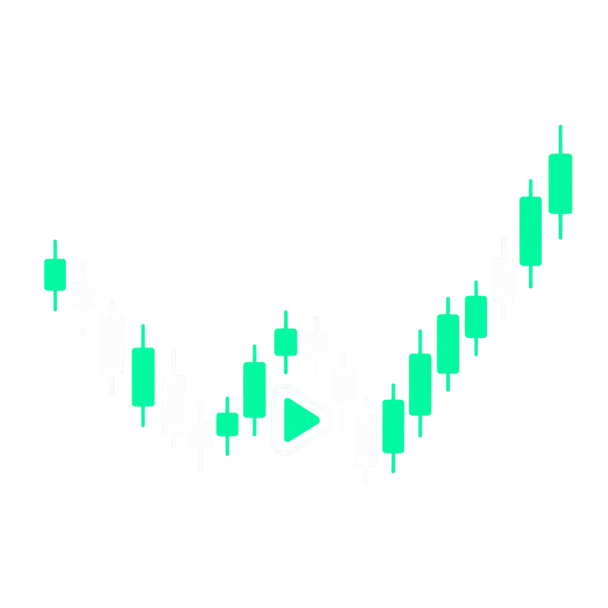
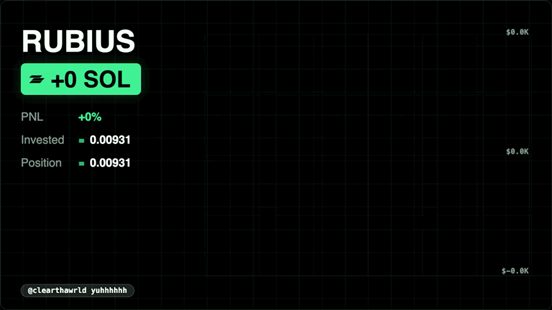
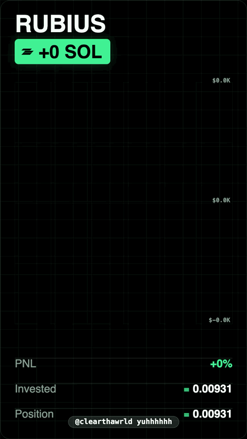
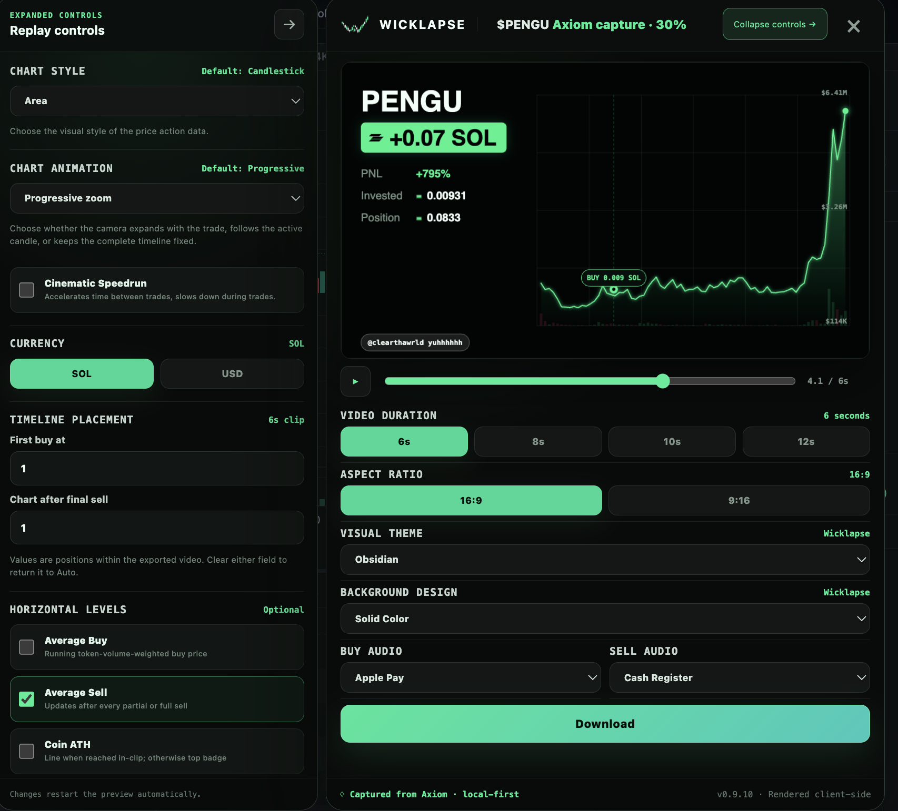

<div align="center">
  
  <h1>Wicklapse</h1>
  <p><strong>Turn any Axiom trade into a polished, share-ready replay video.</strong></p>
  <p>Wicklapse captures your trade directly from Axiom, rebuilds the price action, and renders the finished video locally in your browser.</p>
</div>

## Features

- **One-click Axiom capture** — launch Wicklapse from the Axiom Share menu on any supported token page.
- **Automatic trade reconstruction** — detects your public Axiom trading wallets and combines buys, sells, and partial fills into one replay.
- **Animated market charts** — choose candlestick, OHLC bar, line, or area charts with progressive, fixed, or rolling camera motion.
- **Live performance overlays** — show running P&L, ROI, invested value, position size, execution markers, and optional average buy/sell levels.
- **Flexible video formats** — export landscape or portrait clips for X, TikTok, Reels, Shorts, and other social platforms.
- **Custom timing and style** — control clip duration, trade placement, themes, backgrounds, chart density, currencies, and cinematic speed changes.
- **Built-in audio** — add synchronized buy and sell sounds or use custom audio in the full studio.
- **Local-first rendering** — previews, uploaded media, and video exports stay in your browser.

## See it in action

### Landscape replay

<p align="center">
  
</p>

### Portrait replay

<p align="center">
  
</p>

## How to use Wicklapse

1. Open a token page on Axiom and make sure you are signed in.
2. Open Axiom's **Share** menu.
3. Select **Create Trade Replay with Wicklapse**.
4. Wicklapse detects your public trading wallets and loads the matching executions.
5. Preview the replay and choose the duration, aspect ratio, theme, chart style, currency, and sounds.
6. Expand the controls for timeline placement, chart animation, average price levels, Coin ATH, backgrounds, and other advanced options.
7. Select **Download** to render the finished video locally.

## Customize every replay

<p align="center">
  
</p>

The compact panel covers the essentials without hiding the Axiom chart. Expanded controls expose the full replay editor, including chart presentation, cinematic pacing, horizontal levels, timing, audio, backgrounds, and export format.

## Install from source

```bash
npm ci
npm run build
```

Then open `chrome://extensions`, enable **Developer mode**, select **Load unpacked**, and choose the generated `Wicklapse-Unpacked` folder. Reload any Axiom tabs that were already open.

Wicklapse is an independent project and is not affiliated with or endorsed by Axiom or any other named service.
